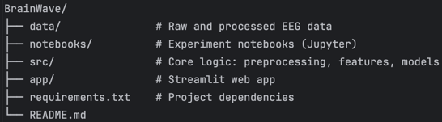

# 🧠 BrainWaveML

**BrainWaveML** is a portfolio project that combines machine learning and neuroscience. The goal is to classify mental states based on EEG signals using real-world open-access biological data.

## 🎯 Project Objectives

- Learn how to work with biosignals (EEG)
- Explore preprocessing techniques for noisy data
- Build ML/Deep Learning models to classify brain states
- Develop an interactive app to visualize and demonstrate results

## 🗂️ Project Structure


BrainWave/
├── data/               # Raw and processed EEG data
├── notebooks/          # Experiment notebooks (Jupyter)
├── src/                # Core logic: preprocessing, features, models
├── app/                # Streamlit web app
├── requirements.txt    # Project dependencies
└── README.md


## 🧪 Data

Using the [EEG Motor Movement/Imagery Dataset](https://physionet.org/content/eegmmidb/1.0.0/) from PhysioNet.

To keep the repository lightweight, EEG data files are not included.  
You can automatically download and organize them by running:
   ```bash
   python src/download_multiple.py
   ```


## ⚙️ Technologies

- Python
- MNE, NumPy, SciPy
- Scikit-learn, TensorFlow / PyTorch
- Streamlit
- Matplotlib, Seaborn, Plotly

## 🚀 Getting Started

1. Create a virtual environment:
   ```bash
   python -m venv .venv
   source .venv/bin/activate  # or .venv\Scripts\activate on Windows

3. Install dependencies:
   ```bash
   pip install -r requirements.txt
   
3. Run the Streamlit app:
   ```bash
   streamlit run app/streamlit_app.py

## 🔭 Roadmap
 
- Load and explore raw EEG data
- Preprocess EEG signals (filtering, normalization, segmentation)
- Extract relevant features
- Train and evaluate baseline ML models
- Build a minimal interactive interface for predictions

## 📄 `requirements.txt`
```txt
numpy
scipy
pandas
scikit-learn
mne
matplotlib
seaborn
plotly
streamlit
jupyter